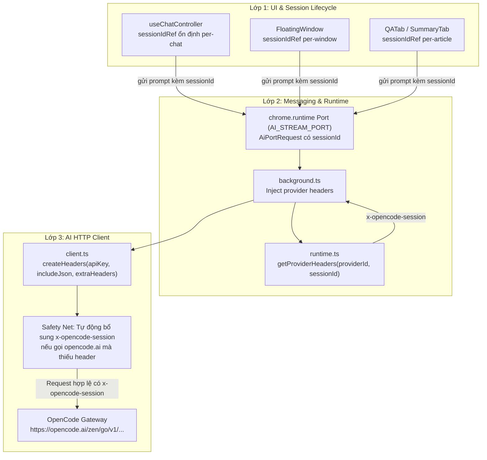

# Kế hoạch sửa lỗi Provider OpenCode: Thiếu Header `x-opencode-session`

> **Mục tiêu:** Khắc phục lỗi `Error from provider (Console Go): Request is missing x-opencode-session and cannot be routed efficiently. Please see https://opencode.ai/docs/go/#where-can-i-use-it` khi sử dụng OpenCode provider trong tiện ích.
> 
> **Ngày lập kế hoạch:** 07/09/2026  
> **Trạng thái:** Hoàn thành (Completed)  
> **Ngôn ngữ UI / Tài liệu:** Tiếng Việt (vi)

---

## 1. Phân tích nguyên nhân gốc rễ (Root Cause Analysis)

### 1.1 Hiện tượng lỗi
Khi người dùng chọn provider **OpenCode** (hoặc kiểm tra kết nối / gửi tin nhắn chat / tra cứu từ), hệ thống trả về lỗi từ server:
```text
Error from provider (Console Go): Request is missing x-opencode-session and cannot be routed efficiently. Please see https://opencode.ai/docs/go/#where-can-i-use-it
```

### 1.2 Cơ chế hoạt động của OpenCode Go / Console Go
Theo tài liệu chính thức của OpenCode tại [`https://opencode.ai/docs/go/#where-can-i-use-it`](https://opencode.ai/docs/go/#where-can-i-use-it):
1. OpenCode Go là dịch vụ proxy/router phân phối tải thông minh đến các model mã nguồn mở (DeepSeek, GLM, Kimi, MiniMax, Qwen,...).
2. Kể từ ngày **06/09/2026**, OpenCode Go bắt đầu kiểm tra bắt buộc (enforce) sự hiện diện của HTTP header:
   ```http
   x-opencode-session: <session-id-duy-nhat-cho-cuoc-hoi-thoai>
   ```
3. **Mục đích của header:**
   - **Session Routing Affinity:** Định tuyến tất cả request của một phiên hội thoại về cùng một backend node.
   - **Prompt Caching:** Giữ "warm cache" prompt và context trên backend, giảm độ trễ và tiết kiệm tài nguyên.
4. Nếu một request gửi đến các endpoint OpenCode Go (`https://opencode.ai/zen/go/v1/...`) mà **thiếu header `x-opencode-session`**, router của Console Go sẽ chặn lại ngay lập tức và trả về lỗi trên.

### 1.3 Nguyên nhân trong mã nguồn của Extension
1. **Trong [`src/core/ai/client.ts`](file:///Volumes/KINGSTON/Projects/MyProject/extentions/my_sider_extention/src/core/ai/client.ts):**
   - Hàm `createHeaders(apiKey?: string, includeJson = false)` hiện chỉ thiết lập `Authorization: Bearer <key>` và `Content-Type: application/json`.
   - Không có cơ chế nhận thêm custom headers hoặc `sessionId`.
   - Các hàm `streamChatCompletion`, `fetchCompletion`, `testConnection` đều không nhận và không gửi header `x-opencode-session`.
2. **Trong [`src/core/ai/runtime.ts`](file:///Volumes/KINGSTON/Projects/MyProject/extentions/my_sider_extention/src/core/ai/runtime.ts):**
   - Chỉ có hàm `getThinkingParams` và `getDevStreamParams`, chưa có cơ chế giải quyết provider-specific headers (`getProviderHeaders`).
3. **Trong [`entrypoints/background.ts`](file:///Volumes/KINGSTON/Projects/MyProject/extentions/my_sider_extention/entrypoints/background.ts):**
   - Cổng stream `AI_STREAM_PORT` và message `TEST_CONNECTION` gọi trực tiếp vào `streamChatCompletion` và `testConnection` mà không gắn header của OpenCode.
4. **Trong các UI Controller / Components ([`useChatController.ts`](file:///Volumes/KINGSTON/Projects/MyProject/extentions/my_sider_extention/entrypoints/sidepanel/hooks/useChatController.ts), [`FloatingWindow.tsx`](file:///Volumes/KINGSTON/Projects/MyProject/extentions/my_sider_extention/src/components/floating-window/FloatingWindow.tsx), [`QATab.tsx`](file:///Volumes/KINGSTON/Projects/MyProject/extentions/my_sider_extention/entrypoints/reader/components/QATab.tsx),...):**
   - Mỗi tin nhắn gửi đi chỉ có một `requestId` mới tạo (`crypto.randomUUID()`), không duy trì `sessionId` xuyên suốt cuộc hội thoại. Khi chat nhiều lượt, phía backend không nhận diện được cùng một session để tận dụng cache.

---

## 2. Giải pháp kiến trúc (Architecture Design)

Thiết kế giải pháp theo mô hình **3 lớp bảo vệ (Defense in Depth)**:



### Chi tiết các lớp:
1. **Lớp 1 - Quản lý vòng đời Session:**
   - Trong Sidepanel Chat ([`useChatController`](file:///Volumes/KINGSTON/Projects/MyProject/extentions/my_sider_extention/entrypoints/sidepanel/hooks/useChatController.ts)): Lưu giữ một `sessionId` ổn định (`crypto.randomUUID()`) cho cuộc hội thoại hiện tại. Khi người dùng nhấn "Chat mới" (`clearChat()`), tạo một `sessionId` mới.
   - Trong Cửa sổ nổi ([`FloatingWindow`](file:///Volumes/KINGSTON/Projects/MyProject/extentions/my_sider_extention/src/components/floating-window/FloatingWindow.tsx)): Khởi tạo `sessionId` gắn liền với lần bật cửa sổ đó (bao gồm cả các câu hỏi tiếp nối).
   - Trong Trợ lý đọc ([`QATab`](file:///Volumes/KINGSTON/Projects/MyProject/extentions/my_sider_extention/entrypoints/reader/components/QATab.tsx), [`SummaryTab`](file:///Volumes/KINGSTON/Projects/MyProject/extentions/my_sider_extention/entrypoints/reader/components/SummaryTab.tsx)): Duy trì `sessionId` gắn liền với bài viết đang đọc.

2. **Lớp 2 - Định tuyến thông điệp & Headers:**
   - Mở rộng kiểu [`AiPortRequest`](file:///Volumes/KINGSTON/Projects/MyProject/extentions/my_sider_extention/src/core/messaging/types.ts) thêm trường tùy chọn `sessionId?: string`.
   - Bổ sung hàm [`getProviderHeaders(providerId: string, sessionId?: string)`](file:///Volumes/KINGSTON/Projects/MyProject/extentions/my_sider_extention/src/core/ai/runtime.ts):
     - Nếu `providerId === "opencode"`: trả về `{ "x-opencode-session": sessionId || crypto.randomUUID() }`.
     - Ngược lại: trả về `undefined`.
   - Trong [`background.ts`](file:///Volumes/KINGSTON/Projects/MyProject/extentions/my_sider_extention/entrypoints/background.ts):
     - Gọi `getProviderHeaders` khi stream chat completions.
     - Gọi `getProviderHeaders` khi chạy `TEST_CONNECTION` (tạo session test dạng `test-${crypto.randomUUID()}`).
     - Truyền `headers` vào `fetchModels` khi tải danh sách model.

3. **Lớp 3 - Lưới an toàn ở HTTP Client (Safety Net):**
   - Cập nhật [`src/core/ai/client.ts`](file:///Volumes/KINGSTON/Projects/MyProject/extentions/my_sider_extention/src/core/ai/client.ts):
     - `createHeaders(apiKey?: string, includeJson = false, extraHeaders?: Record<string, string>)`.
     - Thêm tham số `headers?: Record<string, string>` và `sessionId?: string` vào `streamChatCompletion`, `fetchCompletion`, `testConnection`, `fetchModels`.
     - Nếu URL gọi tới domain `opencode.ai` hoặc `sessionId` được cung cấp nhưng header `x-opencode-session` chưa có, tự động sinh và đính kèm `x-opencode-session`. Điều này đảm bảo dù có bất kỳ lệnh gọi nào bị sót ở UI, request vẫn không bao giờ bị lỗi.

---

## 3. Danh sách công việc chi tiết (Task Breakdown)

### Task 1: Mở rộng Type Definitions

**Mục tiêu:** Khai báo kiểu `sessionId` và `headers` trong messaging và AI client.

**Files cần sửa:**
- [`src/core/messaging/types.ts`](file:///Volumes/KINGSTON/Projects/MyProject/extentions/my_sider_extention/src/core/messaging/types.ts)

**Chi tiết các bước:**
- [x] **Step 1.1:** Mở rộng type `AiPortRequest` trong [`src/core/messaging/types.ts`](file:///Volumes/KINGSTON/Projects/MyProject/extentions/my_sider_extention/src/core/messaging/types.ts):
  ```typescript
  export type AiPortRequest = {
    type: "AI_CHAT_REQUEST";
    requestId: string;
    sessionId?: string; // Định danh phiên hội thoại cho provider routing & caching
    messages: AiMessage[];
    thinkingMode?: Settings["thinkingMode"];
    devContext?: AiDevContext;
  };
  ```
- [x] **Step 1.2:** Kiểm tra compile:
  ```bash
  npm run compile
  ```
  Expected: PASS

---

### Task 2: Bổ sung `getProviderHeaders` trong `runtime.ts`

**Mục tiêu:** Cung cấp hàm trích xuất các header đặc thù của từng provider.

**Files cần sửa:**
- [`src/core/ai/runtime.ts`](file:///Volumes/KINGSTON/Projects/MyProject/extentions/my_sider_extention/src/core/ai/runtime.ts)
- [`tests/ai/runtime.test.ts`](file:///Volumes/KINGSTON/Projects/MyProject/extentions/my_sider_extention/tests/ai/runtime.test.ts)

**Chi tiết các bước:**
- [x] **Step 2.1:** Thêm hàm `getProviderHeaders` vào [`src/core/ai/runtime.ts`](file:///Volumes/KINGSTON/Projects/MyProject/extentions/my_sider_extention/src/core/ai/runtime.ts):
  ```typescript
  export function getProviderHeaders(
    providerId: string,
    sessionId?: string
  ): Record<string, string> | undefined {
    if (providerId === "opencode") {
      return {
        "x-opencode-session": sessionId?.trim() || crypto.randomUUID(),
      };
    }
    return undefined;
  }
  ```
- [x] **Step 2.2:** Viết unit test trong [`tests/ai/runtime.test.ts`](file:///Volumes/KINGSTON/Projects/MyProject/extentions/my_sider_extention/tests/ai/runtime.test.ts):
  - Test 1: `getProviderHeaders("opencode", "sess-123")` trả về `{ "x-opencode-session": "sess-123" }`.
  - Test 2: `getProviderHeaders("opencode")` trả về `{ "x-opencode-session": expect.any(String) }` với UUID hợp lệ.
  - Test 3: `getProviderHeaders("openai")` trả về `undefined`.
  - Test 4: `getProviderHeaders("lmstudio")` trả về `undefined`.
- [x] **Step 2.3:** Chạy test kiểm chứng:
  ```bash
  npx vitest run tests/ai/runtime.test.ts
  ```
  Expected: PASS

---

### Task 3: Cập nhật HTTP Client và Lưới an toàn (`client.ts`)

**Mục tiêu:** Cho phép truyền custom headers trong HTTP requests và tự động đảm bảo có `x-opencode-session` khi gửi tới OpenCode.

**Files cần sửa:**
- [`src/core/ai/client.ts`](file:///Volumes/KINGSTON/Projects/MyProject/extentions/my_sider_extention/src/core/ai/client.ts)
- [`tests/ai/client.test.ts`](file:///Volumes/KINGSTON/Projects/MyProject/extentions/my_sider_extention/tests/ai/client.test.ts)

**Chi tiết các bước:**
- [x] **Step 3.1:** Cập nhật hàm `createHeaders`:
  ```typescript
  function createHeaders(
    apiKey?: string,
    includeJson = false,
    extraHeaders?: Record<string, string>,
  ): Record<string, string> {
    const headers: Record<string, string> = includeJson
      ? { "Content-Type": "application/json" }
      : {};
    const trimmed = apiKey?.trim();
    if (trimmed) headers.Authorization = `Bearer ${trimmed}`;
    if (extraHeaders) {
      Object.assign(headers, extraHeaders);
    }
    return headers;
  }
  ```
- [x] **Step 3.2:** Bổ sung helper resolve request headers để tự động thêm `x-opencode-session` nếu là OpenCode endpoint:
  ```typescript
  function resolveRequestHeaders(options: {
    baseUrl: string;
    apiKey?: string;
    includeJson?: boolean;
    headers?: Record<string, string>;
    sessionId?: string;
  }): Record<string, string> {
    const extraHeaders: Record<string, string> = { ...(options.headers ?? {}) };
    
    // Tự động đảm bảo x-opencode-session cho OpenCode
    const isOpenCode = options.baseUrl.toLowerCase().includes("opencode.ai");
    if (options.sessionId && !extraHeaders["x-opencode-session"]) {
      extraHeaders["x-opencode-session"] = options.sessionId;
    } else if (isOpenCode && !extraHeaders["x-opencode-session"]) {
      extraHeaders["x-opencode-session"] = crypto.randomUUID();
    }

    return createHeaders(options.apiKey, options.includeJson ?? false, extraHeaders);
  }
  ```
- [x] **Step 3.3:** Cập nhật `streamChatCompletion`:
  - Thêm `headers?: Record<string, string>` và `sessionId?: string` vào input.
  - Sử dụng `resolveRequestHeaders` để gán headers cho request POST.
- [x] **Step 3.4:** Cập nhật `fetchCompletion`:
  - Thêm `headers?: Record<string, string>` và `sessionId?: string` vào input.
  - Sử dụng `resolveRequestHeaders` để gán headers cho request POST.
- [x] **Step 3.5:** Cập nhật `testConnection`:
  - Thêm `headers?: Record<string, string>` và `sessionId?: string` vào input.
  - Sử dụng `resolveRequestHeaders` để gán headers cho request POST.
- [x] **Step 3.6:** Cập nhật `fetchModels`:
  - Thêm `headers?: Record<string, string>` vào input.
  - Sử dụng `resolveRequestHeaders` để gán headers cho request GET.
- [x] **Step 3.7:** Bổ sung tests trong [`tests/ai/client.test.ts`](file:///Volumes/KINGSTON/Projects/MyProject/extentions/my_sider_extention/tests/ai/client.test.ts):
  - Test `streamChatCompletion` gửi đúng header `x-opencode-session` khi truyền `sessionId`.
  - Test `streamChatCompletion` tự động tạo `x-opencode-session` khi gọi URL `https://opencode.ai/zen/go/v1/chat/completions`.
  - Test `testConnection` tự động tạo `x-opencode-session` khi gọi URL OpenCode.
  - Test `fetchCompletion` gửi đúng header `x-opencode-session`.
- [x] **Step 3.8:** Chạy test kiểm chứng:
  ```bash
  npx vitest run tests/ai/client.test.ts
  ```
  Expected: PASS

---

### Task 4: Cập nhật Background Service Worker (`background.ts`)

**Mục tiêu:** Tích hợp `getProviderHeaders` vào cổng stream và các message handlers.

**Files cần sửa:**
- [`entrypoints/background.ts`](file:///Volumes/KINGSTON/Projects/MyProject/extentions/my_sider_extention/entrypoints/background.ts)

**Chi tiết các bước:**
- [x] **Step 4.1:** Import `getProviderHeaders` từ `../src/core/ai/runtime`.
- [x] **Step 4.2:** Trong listener `AI_STREAM_PORT`:
  ```typescript
  const providerHeaders = getProviderHeaders(
    runtime.config.providerId,
    message.sessionId,
  );

  await streamChatCompletion({
    baseUrl: runtime.config.baseUrl,
    apiKey: runtime.config.apiKey,
    model: runtime.config.model,
    messages: message.messages,
    extraBodyParams,
    headers: providerHeaders,
    sessionId: message.sessionId,
    signal: controller.signal,
    callbacks: { ... }
  });
  ```
- [x] **Step 4.3:** Trong handler message `TEST_CONNECTION`:
  ```typescript
  if (message.type === "TEST_CONNECTION") {
    getSettings()
      .then((settings) => {
        const runtime = resolveProviderRuntimeConfig(settings);
        if (!runtime.ok) return { ok: false as const, error: runtime.error };
        const testSessionId = `test-${crypto.randomUUID()}`;
        const headers = getProviderHeaders(runtime.config.providerId, testSessionId);
        return testConnection({
          baseUrl: runtime.config.baseUrl,
          apiKey: runtime.config.apiKey,
          model: runtime.config.model,
          headers,
          sessionId: testSessionId,
        });
      })
      .then(sendResponse);
    return true;
  }
  ```
- [x] **Step 4.4:** Trong handler message `LOAD_MODELS`:
  Truyền `headers: getProviderHeaders(runtime.config.providerId)` vào `fetchModels`.
- [x] **Step 4.5:** Kiểm tra compile và chạy test background:
  ```bash
  npm run compile && npx vitest run tests/background-dev-trace.test.ts
  ```
  Expected: PASS

---

### Task 5: Quản lý Session trên UI Components

**Mục tiêu:** Đảm bảo các component giao diện duy trì `sessionId` liên tục trong cùng một cuộc trò chuyện để tối ưu prompt cache.

**Files cần sửa:**
- [`entrypoints/sidepanel/hooks/useChatController.ts`](file:///Volumes/KINGSTON/Projects/MyProject/extentions/my_sider_extention/entrypoints/sidepanel/hooks/useChatController.ts)
- [`src/components/floating-window/FloatingWindow.tsx`](file:///Volumes/KINGSTON/Projects/MyProject/extentions/my_sider_extention/src/components/floating-window/FloatingWindow.tsx)
- [`entrypoints/reader/components/QATab.tsx`](file:///Volumes/KINGSTON/Projects/MyProject/extentions/my_sider_extention/entrypoints/reader/components/QATab.tsx)
- [`entrypoints/reader/components/SummaryTab.tsx`](file:///Volumes/KINGSTON/Projects/MyProject/extentions/my_sider_extention/entrypoints/reader/components/SummaryTab.tsx)
- [`entrypoints/reader/components/DefinitionPopover.tsx`](file:///Volumes/KINGSTON/Projects/MyProject/extentions/my_sider_extention/entrypoints/reader/components/DefinitionPopover.tsx)

**Chi tiết các bước:**
- [x] **Step 5.1:** Sửa [`useChatController.ts`](file:///Volumes/KINGSTON/Projects/MyProject/extentions/my_sider_extention/entrypoints/sidepanel/hooks/useChatController.ts):
  - Khai báo `const sessionIdRef = useRef<string>(crypto.randomUUID());`
  - Trong `clearChat()`: reset `sessionIdRef.current = crypto.randomUUID();`
  - Trong `sendPrompt()`: truyền `sessionId: sessionIdRef.current` vào `startAiStream(...)`.
- [x] **Step 5.2:** Sửa [`FloatingWindow.tsx`](file:///Volumes/KINGSTON/Projects/MyProject/extentions/my_sider_extention/src/components/floating-window/FloatingWindow.tsx):
  - Khai báo `const sessionIdRef = useRef<string>(crypto.randomUUID());`
  - Truyền `sessionId: sessionIdRef.current` vào lời gọi `start(...)`.
- [x] **Step 5.3:** Sửa [`QATab.tsx`](file:///Volumes/KINGSTON/Projects/MyProject/extentions/my_sider_extention/entrypoints/reader/components/QATab.tsx) & [`SummaryTab.tsx`](file:///Volumes/KINGSTON/Projects/MyProject/extentions/my_sider_extention/entrypoints/reader/components/SummaryTab.tsx):
  - Quản lý `sessionIdRef` cho phiên hỏi đáp của bài viết.
  - Truyền `sessionId: sessionIdRef.current` vào `start(...)`.
- [x] **Step 5.4:** Sửa [`DefinitionPopover.tsx`](file:///Volumes/KINGSTON/Projects/MyProject/extentions/my_sider_extention/entrypoints/reader/components/DefinitionPopover.tsx):
  - Thêm `sessionId: crypto.randomUUID()` vào lời gọi `fetchCompletion(...)`.

---

### Task 6: Kiểm thử toàn diện (Testing & Verification)

**Mục tiêu:** Đảm bảo toàn bộ 175+ bài kiểm thử hiện có tiếp tục vượt qua và bổ sung các kịch bản kiểm thử mới cho session header.

**Files cần sửa / thêm:**
- [`tests/use-chat-controller.test.tsx`](file:///Volumes/KINGSTON/Projects/MyProject/extentions/my_sider_extention/tests/use-chat-controller.test.tsx)
- [`tests/ai/client.test.ts`](file:///Volumes/KINGSTON/Projects/MyProject/extentions/my_sider_extention/tests/ai/client.test.ts)
- [`tests/ai/runtime.test.ts`](file:///Volumes/KINGSTON/Projects/MyProject/extentions/my_sider_extention/tests/ai/runtime.test.ts)

**Chi tiết các bước:**
- [x] **Step 6.1:** Bổ sung test kiểm tra `useChatController` truyền cùng `sessionId` cho các tin nhắn liên tiếp và đổi `sessionId` khi gọi `clearChat()`.
- [x] **Step 6.2:** Chạy toàn bộ test suite của dự án:
  ```bash
  npm test
  ```
  Expected: Toàn bộ test suite PASS.
- [x] **Step 6.3:** Chạy TypeScript type-checking:
  ```bash
  npm run compile
  ```
  Expected: Exit code 0, không có lỗi linter hay type-mismatch.
- [x] **Step 6.4:** Chạy build production:
  ```bash
  npm run build
  ```
  Expected: Build thành công ra `.output/chrome-mv3/`.

---

## 4. Tác động và Rủi ro (Risks & Compatibility)

1. **Khả năng tương thích ngược (Backward Compatibility):**
   - Không thay đổi cấu trúc `chrome.storage.local`, không cần nâng cấp `CURRENT_SCHEMA_VERSION` (giữ nguyên schema version hiện tại).
   - Các provider khác như OpenAI, LMStudio, CommandCode không bị ảnh hưởng vì header `x-opencode-session` chỉ được tạo cho OpenCode hoặc khi có yêu cầu cụ thể.
2. **Quyền riêng tư & Bảo mật:**
   - `x-opencode-session` chỉ là một UUID ngẫu nhiên không định danh cá nhân (opaque UUID identifier), không chứa bất kỳ dữ liệu cá nhân hay thông tin nhạy cảm nào.
3. **Hiệu năng:**
   - Việc bổ sung header không làm tăng chi phí tính toán, ngược lại giúp OpenCode Go kích hoạt prompt caching ở server, cải thiện tốc độ sinh token đầu tiên (time to first token) và giảm độ trễ cho người dùng.
